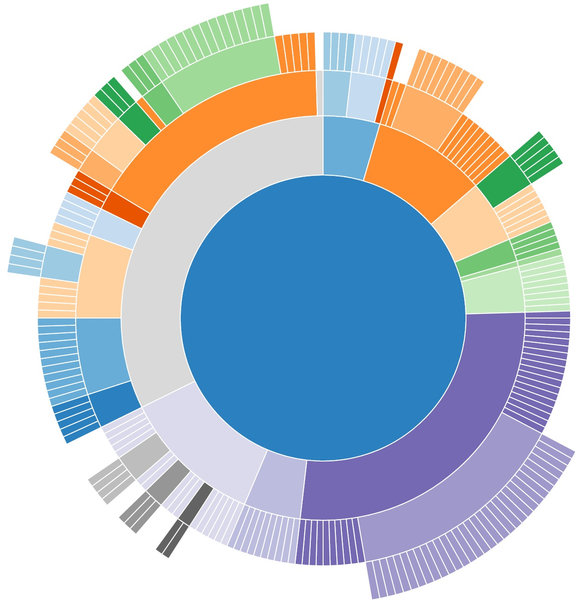

[![Travis Status][trav_img]][trav_site]

Victory Sunburst
=============

`VictorySunburst` draws an SVG sunburst chart with [React][] and [D3](https://github.com/mbostock/d3). Styles and data can be customized by passing in your own values as properties to the component.

## Requirements
Projects using Victory should also depend on [React][] and [prop-types][].

##Examples

The plain component has baked-in sample data and defaults, so rendering the sunburst with no custom properties, like so:

``` javascript
<VictorySunburst />
```

Will look like this:



## The API

### Props

All props are *optional*. They can be omitted and the component will
still render with random data.

The following props are supported:

####**colorScale**

The colorScale prop defines a color scale to be applied to each slice of VictorySunburst. This prop should be given as an array of CSS colors, or as a string corresponding to one of the built in color scales: “grayscale”, “qualitative”, “heatmap”, “warm”, “cool”, “red”, “green”, “blue”. VictorySunburst will assign to each slice by index, unless they are explicitly specified in the data object. Colors will repeat when there are more slices than colors in the provided colorScale.

*Default value:* `d3.schemeCategory20`

####**data**

*An object, with nested properties to make up the tree data structure as shown below.* If the `data` prop is omitted, the sunburst will render sample data. The data has the format:

```
{
  "name": "foo",
  "children": [
    {
      "name": "qux",
      "children": [
        {"name": "asdfgdfs", "size": 98765},
        {"name": "qwertyui", "size": 54321}
      ]
    },
    {"name": "bar", "size": 12345},
    {"name": "baz", "size": 5678}
  ]
}
```

Note that only leaves have `size`.

*Default value:* [flare.json](https://gist.githubusercontent.com/mbostock/1093025/raw/05621a578a66fba4d2cbf5a77e2d1bb3a27ac3d4/flare.json)

####**height**

*A number*

*Default value:* `700`

####**width**

*A number*

*Default value:* `700`

####**displayRoot**

*A boolean* for toggling the display of the sunburst root node.

*Default value:* `false`

####**minRadians**

*A number* in radians used to filter out nodes too small to see. Nodes smaller than `minRadians` aren't displayed.

*Default value:* `0`

####**radius**

*A function* Responsible for making sure the visualization is smaller than the SVG.

*Default value:*

```
radius: (width, height) => {
  return Math.min(width, height) / 2;
}
```

## Issues
To make it easier to manage issues across all of Victory, we have disabled issues for this repo. [Please open issues in the main victory repo instead](https://github.com/FormidableLabs/victory/issues). You can track our progress on issues [here](https://github.com/FormidableLabs/victory/projects/1)

## Development

```sh
# Run the demo app server
$ npm start

# Open the demo app
$ open http://localhost:3000

# Run tests
$ npm test
```

For more on the development environment, see [DEVELOPMENT](https://github.com/FormidableLabs/builder-victory-component-dev/blob/master/DEVELOPMENT.md) in the project builder archetype.

## Contributing

Please review our [Code of Conduct](https://github.com/FormidableLabs/builder-victory-component/blob/master/CONTRIBUTING.md#contributor-covenant-code-of-conduct) before contributing.

For a detailed contribution guide, please see [CONTRIBUTING](https://github.com/FormidableLabs/builder-victory-component-dev/blob/master/CONTRIBUTING.md) in the project builder archetype.

## _IMPORTANT_

This project is in a pre-release state. We're hard at work fixing bugs and improving the API. Be prepared for breaking changes!

**Caveats** git installs using npm 2 may fail in postinstall. If you are consuming Victory via git installs please use npm >=3.0.0

[React]: https://facebook.github.io/react/
[prop-types]: https://github.com/reactjs/prop-types
[trav_img]: https://api.travis-ci.org/FormidableLabs/victory-sunburst.svg
[trav_site]: https://travis-ci.org/FormidableLabs/victory-sunburst
